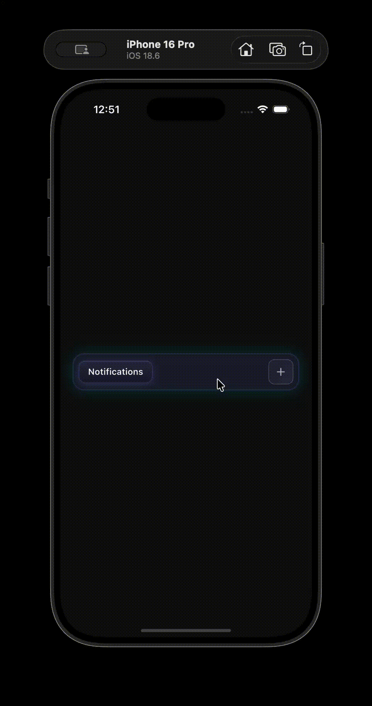

# Chrome-like Tab Bar UI

A Flutter app showcasing a Chrome-style tab bar with smooth animations and a modern glassmorphism design. If you find this project helpful, give it a ⭐ star!

## Demo

## Features

- Chrome-style tab bar with add and close functionality
- Smooth animations and transitions
- Glassmorphism design with blur effects
- Responsive and scrollable tabs

## Getting Started

1. Clone the repository
2. Run `flutter pub get` to install dependencies
3. Run `flutter run` to start the app
